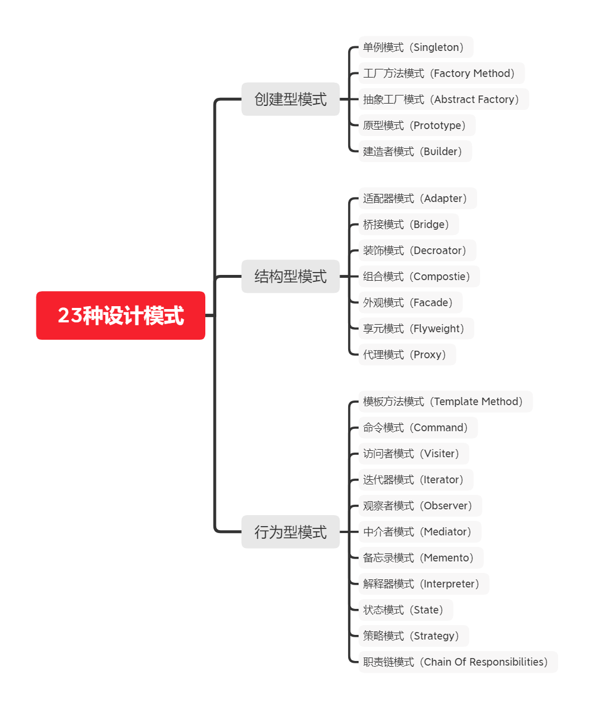

# 简介
23种设计模式，使用 Java 实现，内附每种模式的总结笔记

# 结构图



# 目录
```text
src
    ├─code        - 代码
    │  ├─adapter     - 适配器模式
    │  ├─bridge      - 桥接模式
    │  ├─builder     - 建造者模式
    │  ├─chain       - 职责链模式
    │  ├─command     - 命令模式
    │  ├─composite   - 组合模式
    │  ├─decorator   - 装饰者模式
    │  ├─facade      - 外观模式
    │  ├─factory     - 工厂模式（包含抽象工厂）
    │  ├─flyweight   - 享元模式
    │  ├─interpreter - 解释器模式
    │  ├─iterator    - 迭代器模式
    │  ├─mediator    - 中介者模式
    │  ├─memento     - 备忘录模式
    │  ├─observer    - 观察者模式
    │  ├─proxy       - 代理模式
    │  └─singleton   - 单例模式
    │  └─state       - 状态模式
    │  └─strategy    - 策略模式
    │  └─template    - 模板模式
    │  └─visitor     - 访问者模式
    └─note        - 各个模式的笔记
```